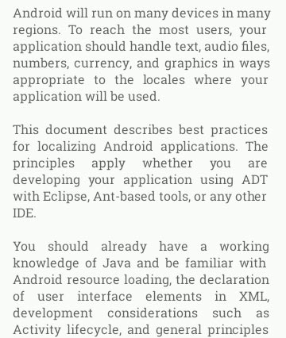

Justified TextView and EditText
===============================

Android TextView or EditText with justified text for API >= 10 (Gingerbread and newer).

Usage
-----

Use an instance of the class ```JustifiedTextView``` for a TextView with justified text.

Use an instance of the class ```ustifiedEditText``` for an EditText with justified text (the
text can be editable).

Project Setup
-------------

Maven:

```xml
<dependency>
  <groupId>com.uncopt</groupId>
  <artifactId>android.justified</artifactId>
  <version>1.0</version>
</dependency>
```

Gradle:

```
dependencies {
    compile 'com.uncopt:android.justified:1.0'
}
```

Sample Application
------------------

[]
(http://play.google.com/store/apps/details?id=com.uncopt.android.example.justify)

The source code for the demo application is in this repository (app folder). 


Implementation Details
----------------------

The best way to implement justification on TextViews would be to extend the Layouts from the
```android.text.Layout```  package. However those Layout classes cannot be extended easily without
relying heavily on java reflection.

The next best thing is probably to add spacing spans to the text. This is what this library is doing.

The text is parsed and measured and spans are added on the whitespace between words to make the
lines stretch the full width as much as possible.
Those spans are very similar to ```ScaleXSpan```, but they do not implement ```ParcelableSpan```
and are not copied by Copy or Cut and Paste operations.

The re-parsing of the text is triggered by:

  - a change of the text content.
  - a re-layout with a different width.
  - a change in the typeface, text size or text scaleX.


Some special characters are not stretched (unless there are more than one in row):

  - thin space
  - hair space
  - non breaking space

Indentation spaces are also left as-is to preserve the alignment.

The lines that do not have any whitespace or that would require the whitespace to be stretched too
much are not justified. The limit for how much stretching is allowed is a factor of 10 by default,
but this default can be changed.


The measuring of the text is not completely accurate (due to floating errors, font hinting, ...)
and as a result, the justification is not perfect and lines can be a few pixels too short. 


Screenshot
----------




Author
------

  Jerome DAVID - [UNCOPT LLC](http://uncopt.com)
  
  We are now making free apps with no ads, and are relying on donations for revenue.
  
  Please check out [our apps](http://uncopt.com/android) on
  [Google Play](http://play.google.com/store/search?q=pub:UNCOPT+LLC) and the [Amazon App Store](http://www.amazon.com/gp/mas/dl/android?s=uncopt+llc&showAll=1).
  
  You can make a donation through a dedicated app with [Google Play in-app-billing](http://play.google.com/store/apps/details?id=com.uncopt.android.donations)
  or [Amazon in-app-purchasing](http://www.amazon.com/gp/mas/dl/android?p=com.uncopt.android.donations).


License
--------

    Copyright 2013 UNCOPT LLC.

    Licensed under the Apache License, Version 2.0 (the "License");
    you may not use this file except in compliance with the License.
    You may obtain a copy of the License at

       http://www.apache.org/licenses/LICENSE-2.0

    Unless required by applicable law or agreed to in writing, software
    distributed under the License is distributed on an "AS IS" BASIS,
    WITHOUT WARRANTIES OR CONDITIONS OF ANY KIND, either express or implied.
    See the License for the specific language governing permissions and
    limitations under the License.